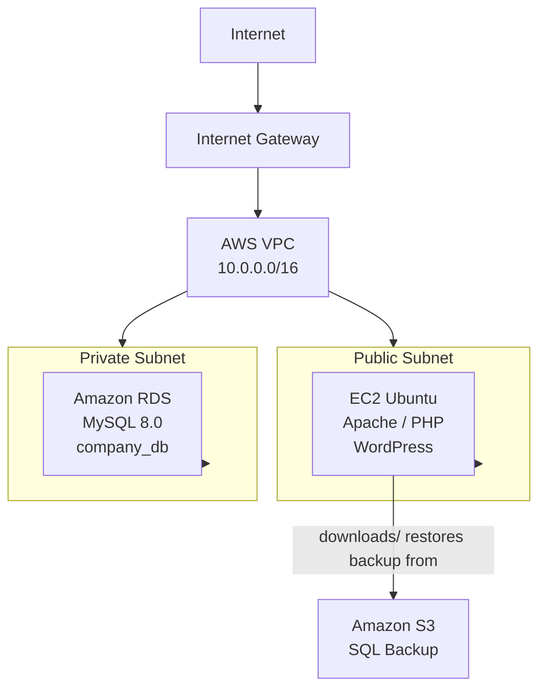
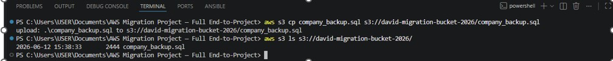
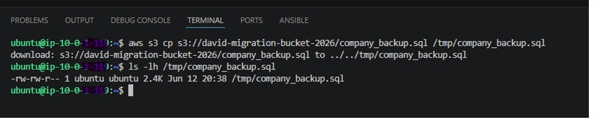
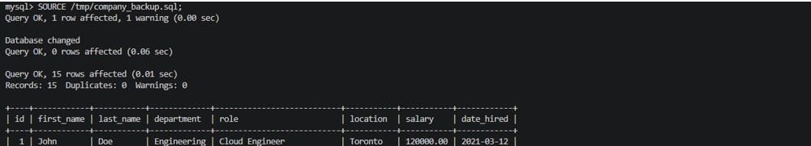

# AWS WordPress & MySQL Migration Using Terraform and Ansible

## Project Objective

This project involved migrating a legacy WordPress website and MySQL database from an outdated hosting environment into Amazon Web Services (AWS). The original environment was difficult to maintain, lacked scalability, and did not provide the reliability needed for future growth. The objective was to rebuild the application in AWS using modern cloud engineering and automation practices.

Terraform was used to provision the entire AWS infrastructure, including networking, security groups, IAM resources, EC2, RDS, S3, and CloudWatch monitoring. After the infrastructure was deployed, the company database backup was uploaded to Amazon S3, transferred to an EC2 instance, and restored into an Amazon RDS MySQL database.

Once the database migration was complete, Ansible was used to automate the installation and configuration of Apache, PHP, MySQL client tools, and WordPress on the EC2 server. The WordPress application was then configured to connect to the migrated RDS database, resulting in a fully functional cloud-hosted environment.

This project demonstrates Infrastructure as Code (IaC), Configuration Management, cloud migration, automation, and AWS architecture skills commonly used by Cloud Engineers, DevOps Engineers, and Systems Administrators.

---


## Architecture Diagram



- Terraform: Infrastructure provisioning
- Ansible: Configuration management
- CloudWatch: Monitoring & alerting
- IAM Role: Secure S3 access

---

---
---

# Project Screenshots

## Upload SQL Backup to Amazon S3

The legacy database backup was uploaded to Amazon S3 using the AWS CLI before the migration process began.



---

## Download SQL Backup from S3 to EC2

The SQL backup was downloaded from Amazon S3 to the EC2 instance where the migration was performed.



---

## Import Database into Amazon RDS

The SQL backup was successfully restored into Amazon RDS MySQL. The database tables and records were imported and verified after the migration.



---

# Technologies Used

## Cloud Platform

* AWS

## Infrastructure as Code

* Terraform

## Configuration Management

* Ansible

## AWS Services

* Amazon EC2
* Amazon RDS MySQL
* Amazon S3
* AWS IAM
* Amazon CloudWatch
* Amazon VPC
* Security Groups

## Operating System

* Ubuntu Server 24.04

## Application Stack

* Apache2
* PHP
* WordPress
* MySQL

---

# Infrastructure Components

## Networking

* VPC
* Public Subnet
* Private Subnet
* Internet Gateway
* Route Tables
* Security Groups

## Compute

* Ubuntu EC2 Instance
* Apache Web Server
* PHP Runtime
* WordPress Application

## Database

* Amazon RDS MySQL
* Private Database Connectivity

## Storage

* Amazon S3 Bucket
* SQL Backup Storage

## Monitoring

* CloudWatch EC2 CPU Alarm
* CloudWatch RDS Storage Alarm

## Security

* IAM Role
* IAM Instance Profile
* Security Groups
* S3 Public Access Block

---

# Terraform Resources Deployed

The following AWS resources were provisioned using Terraform:

* VPC
* Public Subnet
* Private Subnet
* Internet Gateway
* Route Table
* Route Table Association
* EC2 Security Group
* RDS Security Group
* IAM Role
* IAM Instance Profile
* S3 Bucket
* S3 Public Access Block
* EC2 Instance
* RDS MySQL Instance
* RDS Subnet Group
* CloudWatch CPU Alarm
* CloudWatch Storage Alarm

---

# Migration Process

## Step 1 – Deploy Infrastructure with Terraform

Terraform was used to deploy all AWS resources required for the migration:

```bash
terraform init
terraform validate
terraform plan
terraform apply
```

Resources created:

* EC2
* RDS MySQL
* S3
* IAM
* CloudWatch
* Networking Components

---

## Step 2 – Upload Database Backup to Amazon S3

The legacy database backup was uploaded to Amazon S3 using AWS CLI.

```bash
aws s3 cp company_backup.sql s3://your-bucket-name/company_backup.sql
```

---

## Step 3 – Download Backup to EC2

The SQL backup was downloaded from S3 to the EC2 instance.

```bash
aws s3 cp s3://your-bucket-name/company_backup.sql /tmp/company_backup.sql
```

---

## Step 4 – Restore Database into Amazon RDS

The database was restored into Amazon RDS MySQL.

```sql
CREATE DATABASE company_db;

USE company_db;

SOURCE /tmp/company_backup.sql;
```

---

## Step 5 – Deploy WordPress with Ansible

Ansible automated the installation and configuration of:

* Apache
* PHP
* MySQL Client
* WordPress

```bash
ansible-playbook -i inventory.ini playbook.yml
```

---

## Step 6 – Validate Deployment

Validation included:

* SSH connectivity
* Ansible connectivity
* RDS database connectivity
* Successful SQL import
* WordPress deployment
* WordPress installation page

---

# Repository Structure

```
aws-wordpress-mysql-migration/
├── Terraform/
│   ├── provider.tf
│   ├── variables.tf
│   ├── terraform.tfvars
│   ├── networking.tf
│   ├── security.tf
│   ├── iam.tf
│   ├── ec2.tf
│   ├── rds.tf
│   ├── s3.tf
│   ├── cloudwatch.tf
│   └── outputs.tf
├── Ansible/
│   ├── inventory.ini
│   ├── playbook.yml
│   └── wp-config.php.j2
├── Database/
│   └── sample_backup.sql
├── screenshots/
├── README.md
```

---

# Lessons Learned

This project provided practical experience with Infrastructure as Code, cloud migration, automation, and AWS architecture. Terraform simplified the deployment of cloud infrastructure while Ansible automated server configuration and application deployment.

I gained hands-on experience working with Amazon EC2, Amazon RDS, Amazon S3, IAM roles, security groups, CloudWatch monitoring, Linux administration, MySQL database restoration, and application deployment.

One of the most valuable lessons was troubleshooting connectivity issues between EC2, RDS, Ansible, and AWS networking components. Resolving these challenges improved my understanding of AWS architecture, automation workflows, and real-world cloud migration processes.

---

# Future Improvements

Potential enhancements for a production-ready deployment include:

* NAT Gateway
* Multiple Private Subnets
* Multi-AZ RDS Deployment
* Application Load Balancer
* Route 53 DNS
* HTTPS with AWS Certificate Manager
* Auto Scaling Groups
* AWS WAF
* Automated Backup and Recovery
* CI/CD Pipeline Integration

---

# Author

**David Ikundji**

Master of Science, Computer Science, Artificial Intelligence and Machine Learning

Cloud Engineer 


